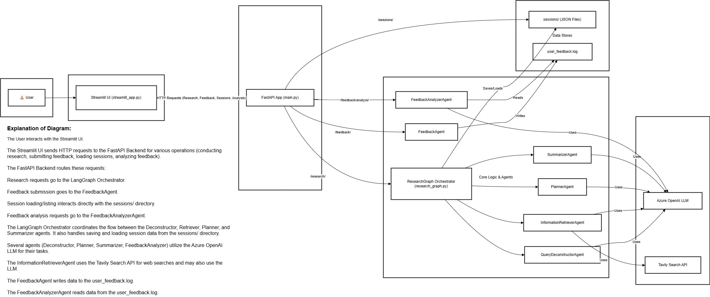

# AI Research Advisor

**Date:** May 22, 2025

This project is an AI-powered research assistant designed to help users explore and understand complex topics by deconstructing queries, retrieving relevant information using web searches, synthesizing this information into a research plan, summarizing the findings, and allowing for user feedback. Research sessions are automatically persisted.

## Core Concepts

This project leverages several key technologies and concepts:

### 1. LangGraph
LangGraph is a library for building stateful, multi-actor applications with LLMs. It allows you to define a graph where each node is a "worker" (an LLM, a tool, or a custom function) and edges define the flow of state between these workers. This is crucial for orchestrating complex workflows like our research process.

   - **Stateful Execution:** The graph maintains a `ResearchGraphState` object that is passed between nodes (agents). Each agent can modify this state, allowing for data accumulation and decision-making throughout the workflow (e.g., storing deconstructed queries, retrieved information, research plans, and summaries).
   - **Conditional Edges:** LangGraph's conditional edges are used to dynamically route the workflow based on the current state, for example, proceeding to the next step or handling errors.

### 2. Pydantic for API Data Validation
[Pydantic](https://pydantic-docs.helpmanual.io/) is used in the FastAPI backend to define and validate the structure of API requests and responses.

   - **Data Schemas:** We define Python classes inheriting from `pydantic.BaseModel` (e.g., `ResearchRequest`, `ResearchResponse`, `UserFeedback` in `app/schemas/research_schemas.py`). These classes specify the expected fields, their types, and any validation rules. `ResearchPlan` and `SummarizedOutput` are also Pydantic models defining the structure of outputs from their respective agents.
   - **Automatic Validation & Serialization:** FastAPI uses these models to automatically validate incoming request data and serialize outgoing response data to JSON.
   - **API Documentation:** These Pydantic models are also used by FastAPI to generate OpenAPI (Swagger) documentation.

### 3. Agent-Based Architecture
The application employs a multi-agent system orchestrated by LangGraph. Each agent is responsible for a specific task:

   - **`QueryDeconstructorAgent`**: Breaks down the user's complex query into smaller, manageable sub-queries using an LLM.
   - **`InformationRetrieverAgent`**: For each sub-query, retrieves relevant information from the web using the **Tavily Search API**. This allows the agent to access up-to-date information.
   - **`PlannerAgent`**: Takes the original query, deconstructed sub-queries, and retrieved information to generate a structured `ResearchPlan`. This plan outlines steps and synthesis questions to guide the user.
   - **`SummarizerAgent`**: Processes the retrieved information to generate a concise `SummarizedOutput`, including a summary text and key bullet points.
   - **`FeedbackAgent`**: A simple agent (not part of the main research graph) that records user feedback (text and rating) about the research results into a log file (`user_feedback.log`).
   - **`FeedbackAnalyzerAgent`**: Analyzes the stored feedback to provide insights like average ratings and qualitative summaries.

### 4. Agent-to-Agent (A2A) Communication
In LangGraph, A2A communication is implicitly handled through the shared `ResearchGraphState`.

   - **Shared State:** As one agent (a node in the graph) completes its task, it updates the central state object (e.g., `deconstructed_queries`, `retrieved_information`, `plan`, `summary`).
   - **Graph Routing:** LangGraph then routes this updated state to the next agent(s) in the sequence, as defined by the graph's edges and conditional logic.

### 5. User Feedback Logging
A simple mechanism is implemented to capture user feedback.
   - **UI Input:** The Streamlit UI provides a section for users to submit textual feedback and a numerical rating for the research results.
   - **Backend Endpoint:** A dedicated FastAPI endpoint (`/feedback/`) receives this feedback.
   - **`FeedbackAgent`**: This agent logs the feedback (including the original query, feedback text, rating, and a timestamp) to `user_feedback.log` in JSON format.

### 6. Session Persistence
To ensure no loss of research work and for potential future analysis or reloading:
   - **Automatic Saving:** After each research graph execution (successful or with errors), the final `ResearchGraphState` is saved.
   - **JSON Format:** The state is serialized into a JSON file. Pydantic models within the state (like `plan` and `summary`) are converted to dictionaries using their `model_dump()` method.
   - **`sessions/` Directory:** These JSON session files are stored in a `sessions/` directory in the project root, with filenames based on the timestamp of when the session concluded (e.g., `session_YYYYMMDD_HHMMSS_ffffff.json`).

## Project Structure

```
ai_research_advisor/
├── app/                    # Backend FastAPI application
│   ├── __init__.py
│   ├── main.py             # FastAPI app definition, API endpoints
│   ├── agents/             # Contains individual agents for different tasks
│   │   ├── __init__.py
│   │   ├── deconstructor_agent.py
│   │   ├── feedback_agent.py       # Handles user feedback logging
│   │   ├── feedback_analyzer_agent.py # Analyzes stored feedback
│   │   ├── planner_agent.py        # Generates research plans
│   │   ├── retriever_agent.py    # Retrieves information (uses Tavily)
│   │   └── summarizer_agent.py     # Summarizes information
│   ├── core/               # Core components like configuration
│   │   ├── __init__.py
│   │   └── config.py       # Loads environment variables (API keys), initializes LLM
│   ├── graph/              # LangGraph specific logic
│   │   ├── __init__.py
│   │   └── research_graph.py # Defines the research workflow graph and its state
│   └── schemas/            # Pydantic models for API request/response validation
│       ├── __init__.py
│       └── research_schemas.py
├── docs/
│   └── images/
│       └── MultiAgentArchitecture-ResearchAgent.png # Architecture diagram
├── sessions/               # Stores persisted research session JSON files (GIT IGNORED)
│   └── example_session.json # Example, actual files are gitignored
├── ui/                     # Frontend Streamlit application
│   └── streamlit_app.py    # Streamlit UI code
├── .env                    # Environment variables (API keys, etc.) - GIT IGNORED
├── .env.sample             # Example environment file for users to copy
├── .gitignore              # Specifies intentionally untracked files that Git should ignore
├── LICENSE                 # MIT License file
├── requirements.txt        # Python dependencies
├── user_feedback.log       # Log file for user feedback (GIT IGNORED)
└── README.md               # This file
```

## How It Works

1.  **Frontend (Streamlit):**
    - The user enters a research query into the Streamlit web interface (`ui/streamlit_app.py`).
    - Streamlit sends this query as an HTTP POST request to the FastAPI backend's `/research/` endpoint.

2.  **Backend (FastAPI - `/research/` endpoint):**
    - The endpoint in `app/main.py` receives the request.
    - The request data is validated using the `ResearchRequest` Pydantic model.
    - An instance of `ResearchGraph` (from `app/graph/research_graph.py`) is used to process the query.

3.  **LangGraph Execution (`ResearchGraph`):**
    - **State Initialization:** A `ResearchGraphState` object is created, initially containing the user's `original_query` and other fields set to `None`.
    - **Query Deconstruction (`QueryDeconstructorAgent`):** The state is passed to this agent, which uses an LLM to break down the query into `deconstructed_queries`. The state is updated.
    - **Information Retrieval (`InformationRetrieverAgent`):** Using the `deconstructed_queries`, this agent queries the **Tavily Search API** for each sub-query to fetch relevant web information. The state is updated with `retrieved_information`.
    - **Planning (`PlannerAgent`):** The state (now with query, sub-queries, and retrieved info) is passed to this agent. It generates a `ResearchPlan` (containing plan steps and synthesis questions). The state is updated with the `plan`.
    - **Summarization (`SummarizerAgent`):** The `retrieved_information` is passed to this agent, which generates a `SummarizedOutput` (summary text and key points). The state is updated with the `summary`.
    - **Error Handling:** If any agent encounters an error, it's recorded in the `error` field of the state. Conditional logic in the graph can route to an `error_handler` node, which currently allows the graph to terminate gracefully.
    - **Final State:** The graph execution concludes, returning the final, populated `ResearchGraphState`.

4.  **Session Persistence (`ResearchGraph`):**
    - After the graph execution finishes (or an error occurs within the graph run), the `_save_session` method in `ResearchGraph` is called.
    - It serializes the entire `final_state_from_graph` into a JSON string (handling Pydantic models appropriately) and saves it to a timestamped file in the `sessions/` directory.

5.  **Response to Frontend (FastAPI - `/research/` endpoint):**
    - The FastAPI backend takes the `final_state_from_graph`.
    - It constructs a `ResearchResponse` Pydantic model containing the `original_query`, `deconstructed_queries`, `retrieved_information`, `plan`, and `summary`.
    - This response is sent back to the Streamlit frontend as JSON.

6.  **Display Results (Streamlit):**
    - Streamlit receives the JSON response and displays the information to the user in a structured format, including the original query, deconstructed sub-queries, retrieved information snippets (collapsible per sub-query), the research plan, and the summary.

7.  **User Feedback (Streamlit & FastAPI - `/feedback/` endpoint):**
    - After results are displayed, the user can provide textual feedback and a rating via UI elements in `ui/streamlit_app.py`.
    - Upon submission, Streamlit sends this feedback (original query, feedback text, rating, and a client-generated timestamp) as a POST request to the `/feedback/` endpoint in `app/main.py`.
    - The FastAPI endpoint validates the data using the `UserFeedback` Pydantic model.
    - It then calls the `FeedbackAgent`'s `record_feedback` method, which appends the feedback as a JSON line to the `user_feedback.log` file.

## Architecture

Below is a high-level architecture diagram of the AI Research Advisor system:



This diagram illustrates the main components, including the Streamlit UI, FastAPI backend, LangGraph orchestrator, various agents, external services (Azure OpenAI, Tavily), and data stores (session files, feedback log).

## Project Setup and How to Run

**Prerequisites:**

*   Python 3.10+ installed.
*   Access to Azure OpenAI with an endpoint, API key, and deployment name for a model like GPT-4.
*   A Tavily API key for web search capabilities.

**Setup Instructions:**

1.  **Clone the Repository (if applicable):**
    ```powershell
    # If you have this project in a git repository
    git clone <repository_url>
    cd ai_research_advisor
    ```

2.  **Create a Virtual Environment:**
    Open PowerShell in the project root directory (`ai_research_advisor`).
    ```powershell
    python -m venv .venv
    ```

3.  **Activate the Virtual Environment:**
    ```powershell
    .\.venv\Scripts\Activate.ps1
    ```
    Your terminal prompt should now be prefixed with `(.venv)`.

4.  **Install Dependencies:**
    ```powershell
    pip install -r requirements.txt
    ```

5.  **Configure Environment Variables:**
    - Create a file named `.env` in the project root directory (`ai_research_advisor`).
    - Add your Azure OpenAI and Tavily API credentials to this file. It should look like this:
      ```properties
      # .env
      AZURE_OPENAI_ENDPOINT="your_azure_openai_endpoint"
      AZURE_OPENAI_API_KEY="your_azure_openai_api_key"
      AZURE_OPENAI_API_VERSION="your_api_version" # e.g., 2024-02-01
      AZURE_OPENAI_DEPLOYMENT_NAME="your_deployment_name" # e.g., gpt-4
      TAVILY_API_KEY="your_tavily_api_key"
      ```
    - **Important:** Ensure this `.env` file is listed in your `.gitignore` file to prevent committing secrets.

**Running the Application:**

You need to run two components: the FastAPI backend and the Streamlit frontend.

1.  **Run the FastAPI Backend:**
    - Open a terminal in the project root (`ai_research_advisor`).
    - Ensure your virtual environment is activated (`.\.venv\Scripts\Activate.ps1`).
    - Run the Uvicorn server:
      ```powershell
      uvicorn app.main:app --reload --reload-dir app --port 8000
      ```
      - `--reload`: Enables auto-reloading when code changes.
      - `--reload-dir app`: Specifies that Uvicorn should only watch the `app` directory for changes (to avoid issues with virtual environment file changes triggering reloads).
      - `--port 8000`: Runs the backend on `http://localhost:8000`.
    - You should see output indicating the server is running.

2.  **Run the Streamlit Frontend:**
    - Open a *new* terminal in the project root (`ai_research_advisor`).
    - Ensure your virtual environment is activated in this new terminal as well (`.\.venv\Scripts\Activate.ps1`).
    - Run the Streamlit application:
      ```powershell
      streamlit run ui/streamlit_app.py
      ```
    - Streamlit will typically open the application automatically in your web browser (usually at `http://localhost:8501`). If not, the terminal will provide the Local URL to open.

Now you can interact with the AI Research Advisor through the Streamlit interface!

## Implemented Features

- **Query Deconstruction:** Breaks down complex user queries.
- **Web Information Retrieval:** Uses Tavily API to fetch up-to-date information from the web for sub-queries.
- **Research Planning:** Generates a structured research plan based on retrieved information.
- **Content Summarization:** Provides a concise summary of the gathered information.
- **User Feedback Collection:** Allows users to submit feedback on results, which is logged.
- **Session Persistence:** Automatically saves the entire research state to JSON files for later review or use.
- **Load Past Sessions:** Implemented UI functionality to browse and reload persisted research sessions.
- **More Sophisticated Feedback Analysis:** Analyzes logged feedback using an LLM to provide insights like average ratings and qualitative summaries.

## Future Enhancements (Potential)

- **Advanced Error Handling:** More granular error handling and reporting in the UI.
- **User Authentication:** For multi-user environments or personalized experiences.
- **Iterative Refinement:** Allow the graph to loop or ask for user clarification at certain points.

## Extending the Research Graph with New Agents

This system is designed with extensibility in mind, particularly for adding new agents to the research workflow managed by LangGraph. Here's a step-by-step guide on how to integrate a new agent:

**1. Define the Agent's Logic and Output Schema:**

   a.  **Create the Agent Module:**
       -   In the `app/agents/` directory, create a new Python file for your agent (e.g., `my_new_agent.py`).
       -   Implement your agent class. This class will typically contain the core logic for the agent's task, often involving interaction with an LLM or other services.
       -   Example structure:
         ```python
         # app/agents/my_new_agent.py
         from app.core.config import llm
         from pydantic import BaseModel

         class MyNewAgentOutput(BaseModel):
             processed_data: str
             # ... other output fields

         class MyNewAgent:
             async def process(self, input_data: Any) -> MyNewAgentOutput:
                 # Your agent's logic here
                 # Example: response = await llm.ainvoke(f"Process this: {input_data}")
                 processed_data = f"Processed: {input_data}" # Replace with actual processing
                 return MyNewAgentOutput(processed_data=processed_data)
         ```

   b.  **Define Output Schema (Pydantic Model):**
       -   If your agent produces structured output that needs to be part of the `ResearchGraphState` or `ResearchResponse`, define a Pydantic model for it in `app/schemas/research_schemas.py`.
       -   Import this model in your new agent's file and in `app/graph/research_graph.py`.
         ```python
         # app/schemas/research_schemas.py
         # ... existing imports ...
         class MyNewAgentOutput(BaseModel): # If not already defined in agent file
             processed_data: str
             # ... other output fields

         class ResearchResponse(BaseModel):
             # ... existing fields ...
             my_new_agent_output: MyNewAgentOutput | None = None # Add new field
         ```

**2. Integrate the Agent into `ResearchGraph` (`app/graph/research_graph.py`):**

   a.  **Update `ResearchGraphState`:**
       -   Add a new field to the `ResearchGraphState` TypedDict to hold the output of your new agent.
         ```python
         # app/graph/research_graph.py
         # ... existing imports ...
         from app.agents.my_new_agent import MyNewAgent, MyNewAgentOutput # Import new agent

         class ResearchGraphState(TypedDict):
             # ... existing fields ...
             my_new_agent_output: MyNewAgentOutput | None # Add new state field
         ```

   b.  **Initialize the Agent:**
       -   In the `ResearchGraph.__init__` method, instantiate your new agent.
         ```python
         class ResearchGraph:
             def __init__(self):
                 # ... existing agent initializations ...
                 self.my_new_agent = MyNewAgent()
                 self.graph = self._build_graph()
                 # ...
         ```

   c.  **Create a Node Method for the Agent:**
       -   Add a new asynchronous method to `ResearchGraph` that will serve as the node for your agent in the LangGraph workflow. This method receives the current `state`, calls your agent's processing method, and returns the updated state.
         ```python
         async def _my_new_agent_node(self, state: ResearchGraphState) -> ResearchGraphState:
             print(f"---NODE: MY NEW AGENT--- Input state: {state}")
             if state.get("error"): # Optional: Skip if prior critical error
                 print("---NODE: MY NEW AGENT SKIPPED DUE TO PREVIOUS ERROR---")
                 return state
             
             try:
                 # Prepare input for your agent from the state
                 input_for_new_agent = state.get("some_previous_output_or_original_query") 
                 if not input_for_new_agent:
                     raise ValueError("Missing required input for MyNewAgent")

                 output: MyNewAgentOutput = await self.my_new_agent.process(input_for_new_agent)
                 updated_state = {**state, "my_new_agent_output": output, "error": state.get("error")} # Preserve existing error
                 print(f"---NODE: MY NEW AGENT FINISHED--- Output state partial: {{'my_new_agent_output': {output}}}")
                 return updated_state
             except Exception as e:
                 print(f"Error in MyNewAgent: {e}")
                 current_error = state.get("error")
                 new_error_message = f"Failed in MyNewAgent: {e}"
                 updated_error = f"{current_error}; {new_error_message}" if current_error else new_error_message
                 # Decide how to handle partial state update on error
                 return {**state, "my_new_agent_output": None, "error": updated_error}
         ```

   d.  **Add Node to Workflow in `_build_graph`:**
       -   In the `_build_graph` method, add your new agent's node to the `workflow`.
         ```python
         def _build_graph(self) -> StateGraph:
             workflow = StateGraph(ResearchGraphState)
             # ... existing nodes ...
             workflow.add_node("my_new_agent_node_name", self._my_new_agent_node) # Add new node
             # ...
             return workflow
         ```

   e.  **Define Edges and Update Conditional Logic (`_should_continue`):**
       -   Determine where your new agent fits into the workflow.
       -   Add conditional edges in `_build_graph` to route to your new node from a preceding node.
       -   Update the `_should_continue` method to:
           -   Route *to* your new agent's node when its preconditions are met.
           -   Route *from* your new agent's node to the next appropriate node (or `END`).
       -   Example (conceptual, adapt to your specific flow):
         ```python
         # In _build_graph():
         # workflow.add_conditional_edges(
         #     "previous_node_name",
         #     self._should_continue, # Or a more specific condition
         #     {"my_new_agent_node_name": "my_new_agent_node_name", ...}
         # )
         # workflow.add_conditional_edges(
         #     "my_new_agent_node_name",
         #     self._should_continue, # Or a more specific condition
         #     {"next_node_name": "next_node_name", END: END}
         # )

         # In _should_continue(self, state: ResearchGraphState) -> str:
         # ... existing logic ...

         # Routing TO my_new_agent_node_name
         # if state.get("output_from_previous_node") is not None and \\
         #    state.get("my_new_agent_output") is None:
         #     print("Routing to my_new_agent_node_name.")
         #     return "my_new_agent_node_name"

         # Routing FROM my_new_agent_node_name
         # if state.get("my_new_agent_output") is not None and \\
         #    state.get("output_for_next_node") is None: # Assuming it leads to another node
         #     print("Routing from my_new_agent_node_name to next_node_name.")
         #     return "next_node_name"
         # ...
         ```
       -   **Important:** Carefully consider the entry and exit points for your new agent and how it affects the overall graph flow. Ensure all paths are covered in `_should_continue`.

**3. Update API Response (Optional - `app/main.py`):**

   -   If the output of your new agent needs to be returned by the API to the frontend:
       -   Ensure the `ResearchResponse` Pydantic model in `app/schemas/research_schemas.py` has a field for it (as shown in step 1b).
       -   In `app/main.py`, update the `/research/` endpoint to extract the new agent's output from the `final_state_from_graph` and include it in the `ResearchResponse`.
         ```python
         # app/main.py
         async def research(request: ResearchRequest):
             # ... existing code ...
             return ResearchResponse(
                 # ... existing fields ...
                 my_new_agent_output=final_state_from_graph.get("my_new_agent_output"),
                 error=final_state_from_graph.get("error")
             )
         ```

**4. Update UI (Optional - `ui/streamlit_app.py`):**

   -   If the new agent's output should be displayed in the Streamlit UI:
       -   Modify `ui/streamlit_app.py` to handle and display the new data field from the `ResearchResponse`.
         ```python
         # ui/streamlit_app.py
         # In the section where results are displayed:
         # response_data = response.json()
         # ...
         # if response_data.get("my_new_agent_output"):
         #     st.subheader("My New Agent's Output")
         #     st.write(response_data["my_new_agent_output"].get("processed_data")) # Access specific fields
         ```

**General Considerations for New Agents:**

*   **Error Handling:** Implement robust error handling within your agent's node method. Update the `error` field in the `ResearchGraphState` accordingly. The `_should_continue` logic and `error_handler_node` can then manage workflow based on these errors.
*   **State Management:** Agents should only modify their designated fields in the `ResearchGraphState` or add to existing collections in a well-defined way. Avoid overwriting unrelated parts of the state.
*   **Dependencies:** If your agent requires new Python packages, add them to `requirements.txt` and reinstall dependencies (`pip install -r requirements.txt`).
*   **API Keys/Configuration:** If your agent needs API keys or other configuration, add them to `.env` and load them via `app/core/config.py`.
*   **Testing:** Thoroughly test the integration of your new agent, including success and failure scenarios.

By following these steps, you can systematically extend the capabilities of the AI Research Advisor by adding new, specialized agents to the LangGraph workflow.


